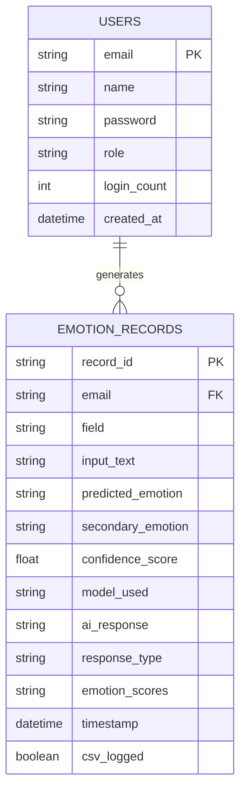

# Entity-Relationship Diagram

Entity-relationship diagram for the AI Learning Assistant platform's
planned persistence layer (Users and Emotion_Records).

## Entities

### USERS
Represents students, learners, or educators using the platform.

| Field | Type | Notes |
|---|---|---|
| email | string | Primary key — unique identifier |
| name | string | User's name |
| password | string | Hashed/encrypted password |
| role | string | student / educator / admin |
| login_count | int | Login/activity metadata |
| created_at | datetime | Account creation timestamp |

### EMOTION_RECORDS
Represents individual emotion analysis sessions and AI-generated
learning support responses.

| Field | Type | Notes |
|---|---|---|
| record_id | string | Primary key |
| email | string | Foreign key → USERS.email |
| field | string | Academic field (e.g. Computer Science, Mathematics) |
| input_text | string | Student's problem description |
| predicted_emotion | string | Primary detected emotion |
| secondary_emotion | string | Additional emotion for mixed-emotion analysis |
| confidence_score | float | Model confidence percentage |
| model_used | string | BiLSTM or BERT |
| ai_response | string | AI-generated supportive response |
| response_type | string | Gemini AI or predefined template |
| emotion_scores | string | Full probability breakdown across all classes |
| timestamp | datetime | Interaction date/time |
| csv_logged | boolean | Whether the interaction was written to the CSV log |

## Relationship

One `USERS` record can generate many `EMOTION_RECORDS` (1-to-many).
Each `EMOTION_RECORDS` row belongs to exactly one user, enforced via
the `email` foreign key.

## Notes

This schema is normalized into two entities to avoid redundancy: user
identity/auth data lives in `USERS`, while each individual emotion
analysis interaction lives in `EMOTION_RECORDS`, linked back to its
owner. It maps cleanly onto either a relational database (PostgreSQL)
or a document store (MongoDB/Firebase/DynamoDB) for future persistence
if the current CSV-based logging is replaced with a real database.
